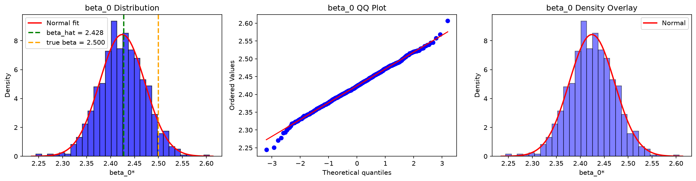
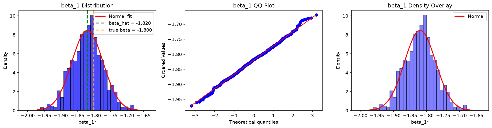
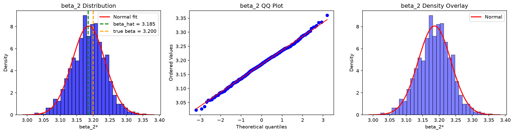
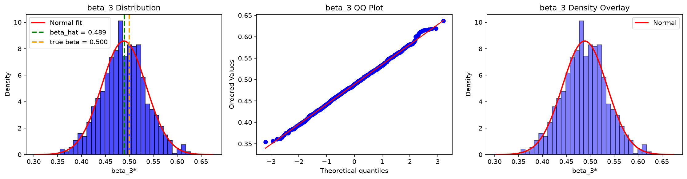
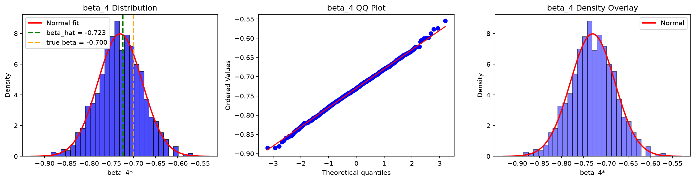

# Federated Residual Bootstrap Research Platform
## Technical Documentation

---

## 1. Project Overview

### 1.1 Research Objective

The project investigates whether classical residual bootstrap procedures can be reproduced in a federated learning environment without sharing raw data.

**Central Research Question:**

$$\mathcal{L}(\hat{\beta}_{Fed}^{*}) \overset{?}{\approx} \mathcal{L}(\hat{\beta}_{Central}^{*})$$

where:
- $\hat{\beta}_{Fed}^{*}$: Bootstrap estimator under federation
- $\hat{\beta}_{Central}^{*}$: Bootstrap estimator from fully pooled data
- $\mathcal{L}$: Sampling distribution

### 1.2 Why This Matters

Classical residual bootstrap requires access to the complete residual pool:

$$\{e_1, e_2, \ldots, e_N\}$$

In federated learning:
- Raw observations cannot be shared
- Features cannot be shared
- Labels cannot be shared
- Residuals may also be private

Therefore, the classical residual bootstrap cannot be directly implemented in federated settings.

### 1.3 Project Phases

| Phase | Focus | Status |
|-------|-------|--------|
| Phase 0 | Infrastructure Construction | ✅ Complete |
| Phase 1 | Centralized Bootstrap Benchmark | ✅ Complete |
| Phase 1.5 | Statistical Validation Framework | ✅ Complete |
| Phase 1.75 | Benchmark Hardening | ✅ Complete |
| Phase 2 | Local Residual Bootstrap | ✅ Complete |
| Phase 2.25 | High-Power Validation | ✅ Complete |
| Phase 2.5 | Cross-Site Heterogeneity | ✅ Complete |
| Phase 2.75 | Independent Audit | ✅ Complete |
| Phase 3 | Residual Summary Bootstrap | 🔜 Next |

---

## 2. Architecture Overview

### 2.1 Package Structure

```
federated_bootstrap_research/
├── __init__.py                 # Package root
├── bootstrap_methods/           # Bootstrap implementations
│   ├── centralized.py          # Centralized residual bootstrap
│   └── local_residual.py       # Local residual bootstrap
├── config/                      # Configuration
│   └── default.yaml
├── data_generation/             # Data generation
│   ├── linear_model.py         # IID data generator
│   ├── heavy_tailed.py         # Heavy-tailed errors
│   ├── skewed.py               # Skewed errors
│   ├── heteroscedastic.py      # Heteroscedastic errors
│   └── site_heterogeneity.py   # Cross-site heterogeneity
├── federated/                   # Federated operations
│   ├── partition.py            # Data partitioning
│   └── federated_ols.py        # Federated OLS
├── metrics/                     # Evaluation metrics
│   ├── coverage.py             # Coverage probability
│   ├── bias.py                 # Bias computation
│   ├── mse.py                  # Mean squared error
│   ├── theoretical_se.py       # Theoretical SE
│   ├── wasserstein.py          # Wasserstein distance
│   └── ks_distance.py          # KS distance
├── experiments/                 # Experiment scripts
│   ├── coverage_study.py       # Coverage validation
│   ├── se_comparison.py        # SE comparison
│   ├── asymptotic_study.py     # Asymptotic behavior
│   ├── local_vs_centralized.py # Method comparison
│   ├── federated_coverage_study.py
│   ├── federated_asymptotic_study.py
│   ├── high_power_asymptotic_study.py
│   ├── site_imbalance_study.py
│   ├── site_count_study.py
│   ├── distribution_robustness_study.py
│   ├── cross_site_heterogeneity_study.py
│   ├── asymptotic_heterogeneity_study.py
│   └── extreme_heterogeneity_stress_test.py
├── visualization/               # Plotting utilities
│   └── convergence_plots.py
├── tests/                       # Test suite
│   ├── test_phase0.py
│   ├── test_centralized_bootstrap.py
│   ├── test_local_residual.py
│   ├── test_federated_ols.py
│   └── ...
└── results/                     # Experiment outputs
    ├── phase2/
    ├── phase_2_validation/
    ├── phase_2_5_validation/
    └── phase_2_75_audit/
```

### 2.2 Data Flow

```
1. Data Generation
   ↓
2. Federated Partitioning
   ↓
3. Federated OLS (beta_hat)
   ↓
4. Residual Computation (per site)
   ↓
5. Residual Centering (per site)
   ↓
6. Bootstrap Loop (B iterations)
   ↓
7. Distribution Comparison
   ↓
8. Metrics Computation
```

---

## 3. Key Mathematical Formulas

### 3.1 Linear Model

$$Y = X\beta + \varepsilon$$

where $\varepsilon \sim N(0, \sigma^2)$

### 3.2 OLS Estimation

$$\hat{\beta} = (X^TX)^{-1}X^Ty$$

Implemented using numerically stable solver:
```python
beta_hat = np.linalg.solve(XTX, XTy)
```

### 3.3 Federated OLS

Each site computes:
$$XTX_m = X_m^T X_m$$
$$XTy_m = X_m^T y_m$$

Server aggregates:
$$XTX = \sum_m XTX_m$$
$$XTy = \sum_m XTy_m$$

Then solves:
$$\hat{\beta}_{Fed} = \text{solve}(XTX, XTy)$$

### 3.4 Residual Bootstrap

**Fitted values:**
$$\hat{y} = X\hat{\beta}$$

**Residuals:**
$$e = y - \hat{y}$$

**Centered residuals:**
$$\tilde{e}_i = e_i - \bar{e}$$

**Bootstrap response:**
$$y_i^\* = \hat{y}_i + \tilde{e}_i^\*$$

**Bootstrap estimate:**
$$\hat{\beta}^\* = \text{solve}(X^TX, X^Ty^\*)$$

### 3.5 Evaluation Metrics

**Coverage:**
$$\text{Coverage} = \frac{1}{MC} \sum_{i=1}^{MC} \mathbb{1}(\beta \in CI_i)$$

**Bias:**
$$\text{Bias} = E[\hat{\beta}] - \beta$$

**MSE:**
$$\text{MSE} = E[(\hat{\beta} - \beta)^2]$$

**Wasserstein Distance:**
$$W(\hat{\beta}_{Fed}^\*, \hat{\beta}_{Central}^\*)$$

**KS Distance:**
$$D_{KS} = \sup_x |F_{Fed}(x) - F_{Central}(x)|$$

---

## 4. Directory Reference

| Directory | Purpose |
|-----------|---------|
| `docs/` | Documentation and reports |
| `federated_bootstrap_research/` | Main package |
| `results/` | Experiment outputs |
| `requirements.txt` | Dependencies |

---

## 5. Results and Plots

### 5.1 Diagnostic Plots

The following diagnostic plots show the bootstrap distribution for each coefficient, including histograms with normal overlay, QQ plots, and density comparisons.

#### Beta 0 Diagnostics



#### Beta 1 Diagnostics



#### Beta 2 Diagnostics



#### Beta 3 Diagnostics



#### Beta 4 Diagnostics



### 5.2 Key Results Summary

| Metric | Value | Status |
|--------|-------|--------|
| Average Coverage | 0.9476 | ✅ PASSED (within [0.93, 0.97]) |
| SE Relative Error | 0.35% | ✅ PASSED (< 10%) |
| Wasserstein at n=10000 | 0.001206 | ✅ PASSED (decreasing) |
| Site Imbalance Coverage | 0.944-0.948 | ✅ PASSED (stable) |
| Site Count Coverage | 0.940-0.967 | ✅ PASSED (stable) |

### 5.3 Result Directories

| Directory | Contents |
|-----------|----------|
| `results/coverage/` | Coverage study results (CSV) |
| `results/se_comparison/` | SE comparison results (CSV) |
| `results/asymptotic/` | Asymptotic study results (CSV) |
| `results/diagnostics/` | Diagnostic plots (PNG) |
| `results/runtime/` | Runtime benchmark results (CSV) |
| `results/phase2/` | Phase 2 experimental results |
| `results/phase_2_validation/` | Phase 2.25 validation results |
| `results/phase_2_5_validation/` | Phase 2.5 heterogeneity results |
| `results/phase_2_75_audit/` | Phase 2.75 audit results |

### 5.4 Generating Plots

To generate diagnostic plots for the bootstrap distribution:

```bash
python -m federated_bootstrap_research.experiments.bootstrap_distribution_diagnostics
```

To generate convergence plots:

```bash
python -m federated_bootstrap_research.visualization.convergence_plots
```

---

*Last Updated: 2026-06-17*
