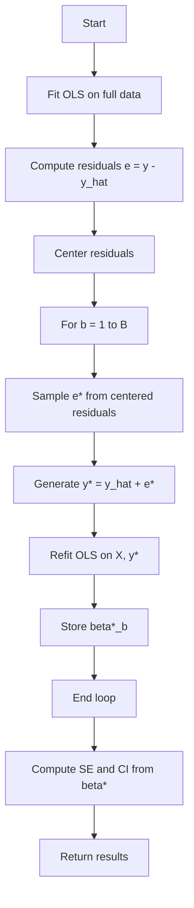
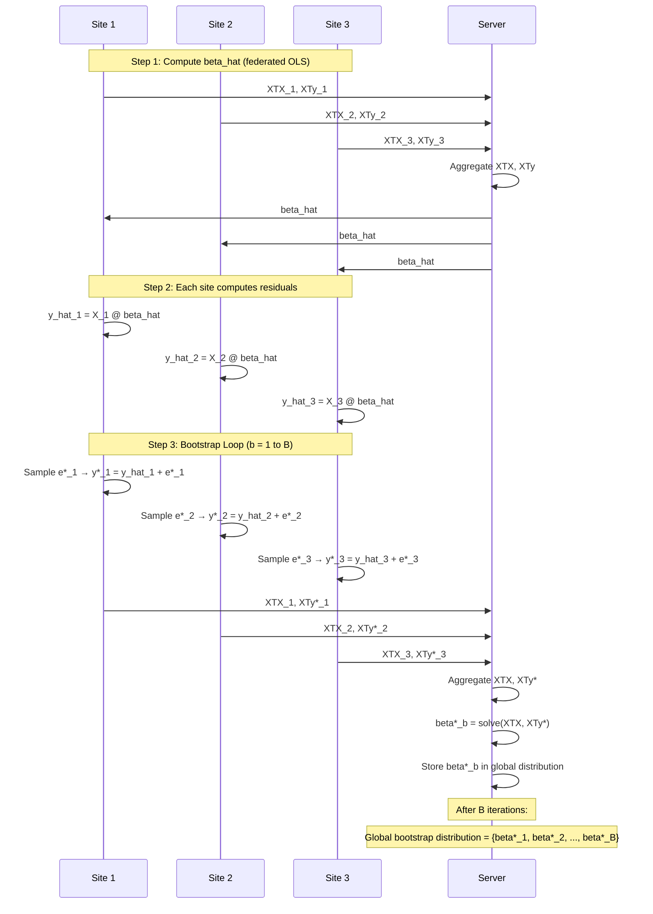
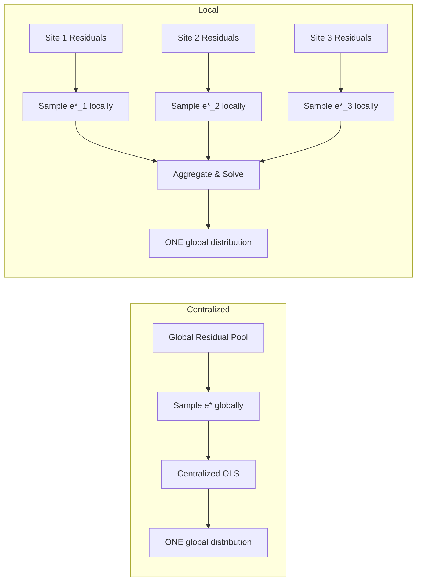

# Bootstrap Methods

## 1. Centralized Residual Bootstrap

### File: `bootstrap_methods/centralized.py`

### Class: `CentralizedResidualBootstrap`

### 1.1 Algorithm Overview



### 1.2 Input

- $X$: Feature matrix (n x p)
- $y$: Response vector (n)
- $B$: Number of bootstrap iterations
- $\alpha$: Significance level

### 1.3 Algorithm Steps

```
1. Fit OLS on original data:
   beta_hat = solve(X^T X, X^T y)
   y_hat = X @ beta_hat
   e = y - y_hat

2. Center residuals:
   e_centered = e - mean(e)

3. For b = 1 to B:
   a. Sample e* with replacement from e_centered
   b. Generate y* = y_hat + e*
   c. Compute beta* = solve(X^T X, X^T y*)
   d. Store beta*

4. Compute:
   bootstrap_se = std(beta* across B)
   ci_lower = percentile(beta*, alpha/2)
   ci_upper = percentile(beta*, 1 - alpha/2)

5. Return results
```

### 1.4 Mathematical Formulas

**OLS:**
$$\hat{\beta} = (X^TX)^{-1}X^Ty$$

**Fitted values:**
$$\hat{y} = X\hat{\beta}$$

**Residuals:**
$$e = y - \hat{y}$$

**Centered residuals:**
$$\tilde{e}_i = e_i - \bar{e}$$

**Bootstrap response:**
$$y_i^\* = \hat{y}_i + \tilde{e}_i^\*$$

**Bootstrap estimate:**
$$\hat{\beta}^\* = (X^TX)^{-1}X^Ty^\*$$

**Standard errors:**
$$SE_j = \text{sd}(\hat{\beta}^\*_j)$$

**Confidence intervals (percentile):**
$$CI_j = [Q_{\alpha/2}(\hat{\beta}^\*_j), Q_{1-\alpha/2}(\hat{\beta}^\*_j)]$$

### 1.5 Output

```python
{
    "beta_hat": np.ndarray,       # OLS estimates (p,)
    "bootstrap_betas": np.ndarray, # Bootstrap estimates (B, p) ← ONE global distribution
    "bootstrap_se": np.ndarray,    # Standard errors (p,)
    "ci_lower": np.ndarray,        # Lower CI bounds (p,)
    "ci_upper": np.ndarray,        # Upper CI bounds (p,)
    "residual_mean": float,        # Mean of residuals
    "centered_residuals": np.ndarray # Centered residuals (n,)
}
```

**Key Point:** The output contains ONE global bootstrap distribution `bootstrap_betas` of shape `(B, p)`.

---

## 2. Local Residual Bootstrap

### File: `bootstrap_methods/local_residual.py`

### Class: `LocalResidualBootstrap`

### 2.1 Algorithm Overview

```mermaid
graph TD
    A[Start] --> B[Federated OLS: compute beta_hat]
    B --> C[Send beta_hat to all sites]
    C --> D[Each site m: compute y_hat_m, e_m]
    D --> E[Each site m: center residuals]
    E --> F[For b = 1 to B]
    F --> G[Each site m: sample e*_m from centered residuals]
    G --> H[Each site m: generate y*_m = y_hat_m + e*_m]
    H --> I[Aggregate all sites: run Federated OLS]
    I --> J[Store beta*_b (ONE global estimate)]
    J --> K[End loop]
    K --> L[Compute SE and CI from beta*]
    L --> M[Return results]
```

### 2.2 Input

- Partitions: List of site data dicts {X_m, y_m}
- $B$: Number of bootstrap iterations
- $\alpha$: Significance level

### 2.3 Algorithm Steps

```
1. Fit federated OLS:
   beta_hat = FederatedOLS.fit(partitions)

2. For each site m:
   a. y_hat_m = X_m @ beta_hat
   b. e_m = y_m - y_hat_m
   c. e_centered_m = e_m - mean(e_m)
   d. Store e_centered_m and y_hat_m

3. For b = 1 to B:
   a. For each site m:
      i. Sample e*_m from e_centered_m
      ii. y*_m = y_hat_m + e*_m
   b. Run federated OLS on (X_m, y*_m)
      → Aggregates XTX_m and XTy*_m from ALL sites
      → Solves to get ONE global beta*_b
   c. Store beta*_b

4. Compute bootstrap_se and CI from beta* (B, p)

5. Return results
```

### 2.4 Output

```python
{
    "beta_hat": np.ndarray,       # Federated OLS estimates (p,)
    "bootstrap_betas": np.ndarray, # Bootstrap estimates (B, p) ← ONE global distribution
    "bootstrap_se": np.ndarray,    # Standard errors (p,)
    "ci_lower": np.ndarray,        # Lower CI bounds (p,)
    "ci_upper": np.ndarray         # Upper CI bounds (p,)
}
```

**Key Point:** The output contains ONE global bootstrap distribution `bootstrap_betas` of shape `(B, p)`, just like the centralized bootstrap.

### 2.5 How ONE Global Distribution is Produced



**Step-by-Step Breakdown:**

| Step | Action | Result |
|------|--------|--------|
| 1 | Each site computes local XTX_m, XTy_m | Site-level statistics |
| 2 | Server aggregates → solve for beta_hat | ONE global beta_hat |
| 3 | Server sends beta_hat to all sites | All sites have same beta_hat |
| 4 | Each site computes local residuals | Site-level residuals |
| 5 | Each site centers residuals | Site-level centered residuals |
| 6 | **For EACH bootstrap iteration b:** | |
| 7 | Each site samples e*_m from its centered residuals | Site-level bootstrap residuals |
| 8 | Each site generates y*_m = y_hat_m + e*_m | Site-level bootstrap response |
| 9 | **Server aggregates XTX_m and XTy*_m from ALL sites** | Global XTX, XTy* |
| 10 | Server solves → ONE beta*_b for this iteration | ONE global estimate |
| 11 | Server stores beta*_b | Part of ONE global distribution |

**After B iterations:** The server has ONE global bootstrap distribution:

$$\{\hat{\beta}^\*_1, \hat{\beta}^\*_2, \ldots, \hat{\beta}^\*_B\} \quad \text{shape: } (B, p)$$

### 2.6 Key Differences from Centralized

| Aspect | Centralized | Local |
|--------|-------------|-------|
| Residual Pool | Global (single pool) | Site-specific (each site has its own) |
| Resampling | From all residuals globally | From local residuals only |
| OLS Refit | Centralized OLS on full data | Federated OLS (aggregated per iteration) |
| Bootstrap Distribution | ONE global distribution `(B, p)` | ONE global distribution `(B, p)` ✅ |
| Privacy | Raw data needed | Only statistics shared |

### 2.7 Comparison Diagram



**Both methods produce ONE global distribution.**

The difference is **how the bootstrap responses are generated**:
- Centralized: from a global residual pool
- Local: from local residual pools

But in BOTH cases, the final bootstrap distribution is a SINGLE global distribution from which we compute SE and CI.

### 2.8 Code Verification

In `bootstrap_methods/local_residual.py`, the `_bootstrap_loop` method:

```python
def _bootstrap_loop(self) -> None:
    p = self.partitions[0]["X"].shape[1]
    self.bootstrap_betas = np.zeros((self.n_bootstrap, p))
    
    for b in range(self.n_bootstrap):
        bootstrap_partitions = []
        
        for site_idx, partition in enumerate(self.partitions):
            X = partition["X"]
            n_site = X.shape[0]
            
            # Each site samples from its own centered residuals
            e_star = self.rng.choice(
                self.site_centered_residuals[site_idx],
                size=n_site,
                replace=True,
            )
            
            # Each site generates its bootstrap response
            y_star = self.site_y_hat[site_idx] + e_star
            bootstrap_partitions.append({"X": X, "y": y_star})
        
        # CRITICAL: Federated OLS aggregates across ALL sites
        # This produces ONE global beta* for this iteration
        federated_ols = FederatedOLS()
        beta_star = federated_ols.fit(bootstrap_partitions)  # ← ONE global beta*
        
        # Store in the global bootstrap distribution
        self.bootstrap_betas[b, :] = beta_star
```

**The key line is:**
```python
beta_star = federated_ols.fit(bootstrap_partitions)
```

`federated_ols.fit()` takes ALL sites' bootstrap data and computes ONE global OLS estimate by aggregating `XTX` and `XTy` from all sites.

So at the end, `self.bootstrap_betas` is a single `(B, p)` matrix — ONE global bootstrap distribution.

---

## 3. Comparison: Centralized vs Local

### 3.1 Theoretical Relationship

**Research Question:**

$$\mathcal{L}(\hat{\beta}_{Local}^\*) \overset{?}{\approx} \mathcal{L}(\hat{\beta}_{Central}^\*)$$

**Both produce ONE global distribution, so they can be directly compared!**

| Method | Distribution | Shape |
|--------|--------------|-------|
| Centralized | $\{\hat{\beta}^\*_{Central,1}, \ldots, \hat{\beta}^\*_{Central,B}\}$ | (B, p) |
| Local | $\{\hat{\beta}^\*_{Local,1}, \ldots, \hat{\beta}^\*_{Local,B}\}$ | (B, p) |

**We can directly compare:**
- Coverage: Does Local CI contain $\beta$ as often as Centralized CI?
- Wasserstein: $W(\hat{\beta}_{Local}^\*, \hat{\beta}_{Central}^\*)$
- KS: $D_{KS}(\hat{\beta}_{Local}^\*, \hat{\beta}_{Central}^\*)$
- Bias: $E[\hat{\beta}_{Local}]$ vs $E[\hat{\beta}_{Central}]$
- MSE: $E[(\hat{\beta}_{Local} - \beta)^2]$ vs $E[(\hat{\beta}_{Central} - \beta)^2]$

### 3.2 Empirical Findings

**Coverage:**

| Distribution | Centralized | Local |
|--------------|-------------|-------|
| IID | 0.944 | 0.948 |
| Heavy-tailed | 0.948 | 0.924 |
| Skewed | 0.944 | 0.940 |
| Heteroscedastic | 0.932 | 0.932 |

**Wasserstein Distance (n=1000):**

| Distribution | Wasserstein |
|--------------|-------------|
| IID | 0.002301 |
| Heavy-tailed | 0.003458 |
| Skewed | 0.003761 |
| Heteroscedastic | 0.003545 |

### 3.3 Convergence

As $n \to \infty$:

$$W(\hat{\beta}_{Local}^\*, \hat{\beta}_{Central}^\*) \to 0$$

| n | Wasserstein |
|---|-------------|
| 100 | 0.01229 |
| 250 | 0.00779 |
| 500 | 0.00534 |
| 1000 | 0.00378 |
| 2500 | 0.00241 |
| 5000 | 0.00173 |
| 10000 | 0.00121 |

---

## 4. Implementation Details

### 4.1 Residual Centering

**Why center residuals?**

Classical residual bootstrap assumes $E[e_i] = 0$.

In finite samples, $\bar{e} \neq 0$.

Centering enforces the assumption:

$$\tilde{e}_i = e_i - \bar{e}$$

### 4.2 Random Number Generation

**Correct:**
```python
rng = np.random.default_rng(random_state)
e_star = rng.choice(residuals, size=n, replace=True)
```

**Incorrect (avoid):**
```python
np.random.seed(random_state)
e_star = np.random.choice(residuals, size=n, replace=True)
```

### 4.3 Confidence Intervals

**Percentile Method:**

$$CI = [Q_{\alpha/2}(\hat{\beta}^\*), Q_{1-\alpha/2}(\hat{\beta}^\*)]$$

**Implementation:**

```python
alpha = 1.0 - confidence_level
lower = np.percentile(bootstrap_betas, (alpha/2) * 100, axis=0)
upper = np.percentile(bootstrap_betas, (1 - alpha/2) * 100, axis=0)
```

---

## 5. Code Example

### Centralized Bootstrap

```python
from federated_bootstrap_research.bootstrap_methods import CentralizedResidualBootstrap

bootstrap = CentralizedResidualBootstrap(
    n_bootstrap=500,
    confidence_level=0.95,
    random_state=42
)
results = bootstrap.fit(X, y)

# ONE global distribution
print(results["bootstrap_betas"].shape)  # (500, p)
```

### Local Residual Bootstrap

```python
from federated_bootstrap_research.bootstrap_methods import LocalResidualBootstrap

bootstrap = LocalResidualBootstrap(
    n_bootstrap=500,
    confidence_level=0.95,
    random_state=42
)
results = bootstrap.fit(partitions)

# ONE global distribution (NOT M separate distributions!)
print(results["bootstrap_betas"].shape)  # (500, p)
```

---

## 6. Summary

| Aspect | Centralized Bootstrap | Local Residual Bootstrap |
|--------|----------------------|--------------------------|
| Data Access | Full pooled data | Only local data per site |
| Residuals | Global | Local (site-specific) |
| Bootstrap Response | y* = y_hat + e* (global) | y*_m = y_hat_m + e*_m (local) |
| Refitting | Centralized OLS | Federated OLS (per iteration) |
| Number of Distributions | ONE global distribution | ONE global distribution |
| Shape | (B, p) | (B, p) |
| Comparison | Reference | Compare against Centralized |

**The Local Residual Bootstrap produces ONE global bootstrap distribution**, just like the centralized bootstrap. The only difference is that the bootstrap samples are generated using local residuals instead of global residuals.

---

*Last Updated: 2026-06-17*
